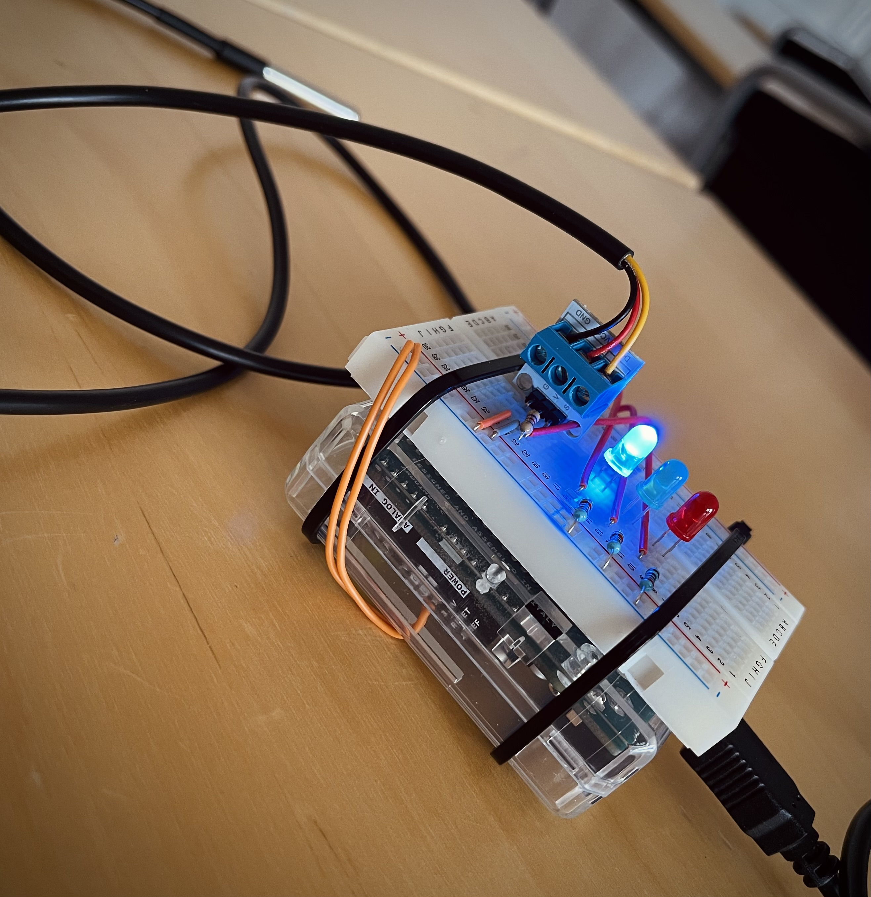
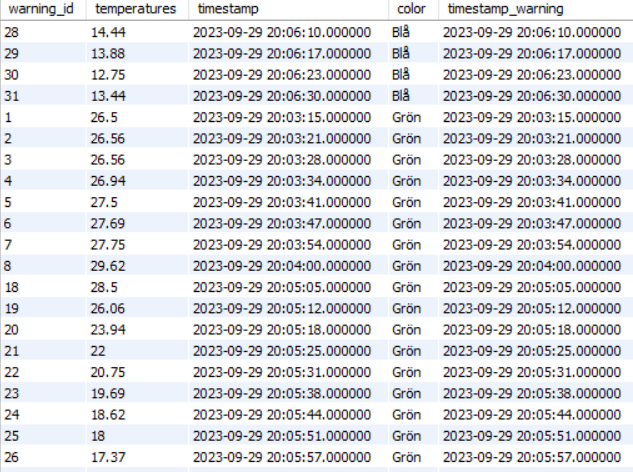
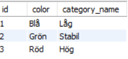
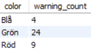
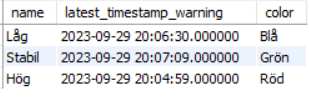

# Arduino Temperature Monitoring System

This project focuses on capturing temperature readings from an Arduino sensor, processing this data, and storing it in a database. The Java backend manages data storage and provides API endpoints to access and manipulate the temperature data.

## Arduino

### Overview

The Arduino code monitors temperature using the Dallas temperature sensor and controls LEDs based on the temperature range. It is designed to:

1. Read temperature values from a Dallas temperature sensor.
2. Display the temperature reading via the Serial monitor.
3. Control LED states based on different temperature ranges.

[**View the Arduino Code**](Arduiono_Temp/Arduino_kod_Temperatur.ino)

### Dependencies

- **OneWire Library**: Used for communication with OneWire devices.
- **DallasTemperature Library**: Provides functionalities to interact with Dallas temperature sensors.

### Setup

The Arduino code initializes the Serial monitor, the Dallas temperature sensor, and sets the desired temperature resolution. It also configures pins 2 to 4 as OUTPUT pins.

# Arduino Temperature Monitoring System

## Visual Overview

### Arduino Hardware Setup

### Database Results

#### Database Overview

#### Category Colors

#### Warning Colors Count

#### Latest Warnings in Categories

## Java Backend

The Java backend is responsible for data processing, storage, and API management. Below is an overview of the main classes. For detailed class-level documentation, refer to `dokumentation_jimmy.md` or the respective class files in the codebase.[dokumentation_jimmy.md](DS18B20-temperature/dokumentation_jimmy.md)

### 1. ArduinoController.java

- Defines an endpoint to receive temperature data from the Arduino device.
- Processes this data and saves it to the database.
- [Detailed Documentation](DS18B20-temperature/src/main/java/com/example/TempDB/Controller/ArduinoController.java)

### 2. Arduino.java

- Interface between the Java application and the Arduino device.
- Reads temperature data from the Arduino via a serial port.
- [Detailed Documentation](DS18B20-temperature/src/main/java/com/example/TempDB/Device/Arduino.java)

### 3. TemperatureDTO.java

- Represents the temperature data structure.
- [Detailed Documentation](DS18B20-temperature/src/main/java/com/example/TempDB/DataTransferObject/TemperatureDTO.java)

### 4. BeanConfig.java

- A configuration class for defining beans and their dependencies.
- [Detailed Documentation](DS18B20-temperature/src/main/java/com/example/TempDB/Config/BeanConfig.java)

### 5. DataBaseConnection.java

- Class to establish a connection to the database.
- [Detailed Documentation](DS18B20-temperature/src/main/java/com/example/TempDB/DatabaseCrud/DataBaseConnection.java)

### 6. CrudQuery.java

- Manages CRUD operations on the database.
- [Detailed Documentation](DS18B20-temperature/src/main/java/com/example/TempDB/DatabaseCrud/CrudQuery.java)

### 7. DatabaseInitializer.java

- Focuses on initializing the database with specific data.
- [Detailed Documentation](DS18B20-temperature/src/main/java/com/example/TempDB/DatabaseCrud/DatabaseInitializer.java)
